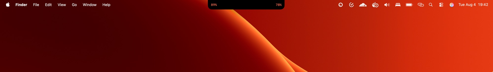
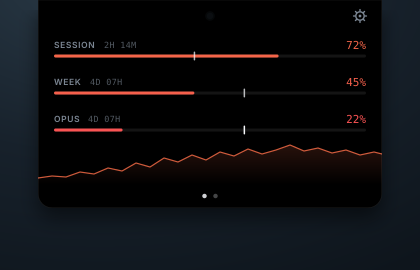
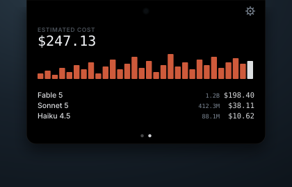

# Claudette

Claudette pins a black-glass island over your Mac's notch showing how much of
your Claude Code limits remain, one numeral on each side of the camera:

<p align="center">
  
</p>

Hover and it expands in place to three gauge bars over a spend sparkline.
Click the panel (or swipe, or tap a dot) to flip to the cost page: your last
30 days of local session logs priced at pay-as-you-go API rates, next to what
your subscription actually costs. Two dots at the bottom show which page
you're on. Right-click for refresh, settings and quit.

<p align="center">
  
  &nbsp;&nbsp;&nbsp;&nbsp;
  
</p>

- Swift 6, SwiftUI, macOS 14+. No dock icon, no external dependencies.
- One-time Sign in with Claude. Claudette keeps its own token after that.
- The notch is detected automatically; non-notched displays get an identical
  synthetic island. Nothing to configure.
- Gauge tint is a continuous Oklab ramp (calm → ember → flare), not traffic
  lights. Each bar carries a **pace tick**: the point usage would be at if
  you burned the window evenly.
- The cost page is entirely local: an incremental scanner over
  `~/.claude/projects/**/*.jsonl`, priced from a bundled table that refreshes
  weekly from this repo.

## Installing from Homebrew

```sh
brew tap taylorgibb/claudette https://github.com/taylorgibb/claudette.git
brew install --cask taylorgibb/claudette/claudette
```

Until releases are signed with a Developer ID and notarized, macOS may block
the first launch; right-click Claudette.app and choose Open, or run
`xattr -dr com.apple.quarantine /Applications/Claudette.app`. Then right-click
the island, open Settings and use **Sign In with Claude**.

## Running from Source

```sh
swift build                    # debug build
swift test                     # both test suites, offline, no external dependencies
scripts/package.sh 0.0.0-dev   # assemble dist/Claudette.app from a release build
```

`swift run Claudette` works but runs unbundled, so login-item registration and
the keychain prompt behave differently; package it for anything beyond a
smoke test.

| Target | Contains |
| --- | --- |
| `ClaudetteCore` | Usage polling, credentials, cost engine, pricing, telemetry. No AppKit or SwiftUI. |
| `ClaudetteUI` | Views, view model, presenters, window and hover management. |
| `Claudette` | `Main.swift`, and nothing else. |

See [CONTRIBUTING.md](CONTRIBUTING.md) for the rules that keep that split
meaningful, [docs/input-handling.md](docs/input-handling.md) for how the
island sits over the notch without stealing clicks, and
[docs/releasing.md](docs/releasing.md) for the release pipeline.

## Privacy

- The access token is read per poll, used for one request, and never written
  to disk or included in any event.
- Session log *contents* never leave the machine; only aggregate token
  counts per model per day are cached locally.
- Release builds send anonymous usage analytics keyed to a random
  per-install UUID: a closed enum of eight event shapes with no free-form
  property, and error messages pass through a redactor. Builds without a
  PostHog key, including anything you build yourself, send nothing at all.

See [SECURITY.md](SECURITY.md) for the full statement and how to report a
problem.

## License

MIT. See [LICENSE](LICENSE).
